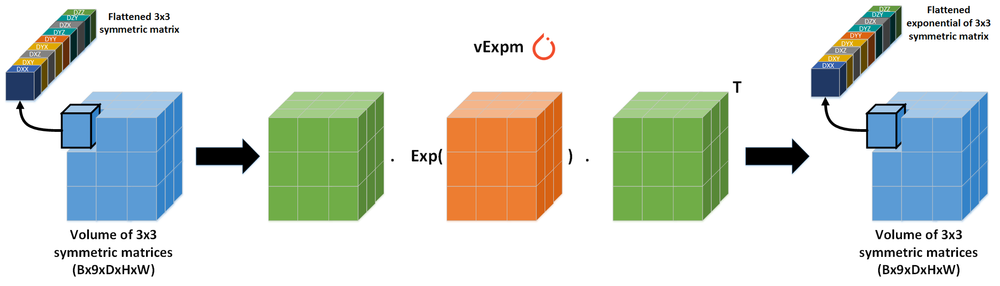
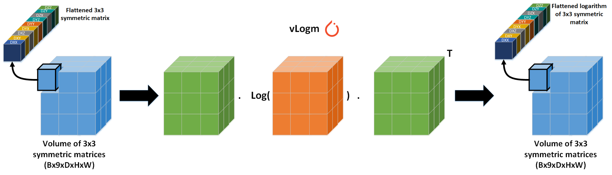

What is Torch Vectorized ?
==========================
Torch Vectorized offers batched and vectorized operations on volume of 3x3 symmetric matrices with Pytorch and their associated differentiable torch.nn.Module layers. The current Pytorch's implementation of batch eigen-decomposition is very slow when dealing with huge number of small matrices (e.g. 500k x 3x3). **This library offers some basic functions like vSymEig, vExpm and vLogm for fast computation (>250x faster) of huge number of small matrices with Pytorch using an analytical solution.**

See **Ionescu et al., Matrix backpropagation for deep networks with structured layers, CVPR 2015** for details on the gradients computation

vSymEig
=======
A quick closed-form solution for volumetric 3x3 matrices Eigen-Decomposition with Pytorch. Solves Eigen-Decomposition of data with shape Bx9xDxHxW, where B is the batch size, 9 is the flattened 3x3 symmetric matrices, D is the depth, H is the Height, W is the width. The goal is to accelerate the Eigen-Decomposition of multiple (>500k) small matrices (3x3) on GPU with Pytorch using an analytical solution.

.. image:: _static/vsymeig.png
  :width: 100%
  :alt: vSymeig

vExpm
=====
Based on vSymEig, computes the matrix exponential for batch of volumetric 3x3 matrices.

vLogm
=====
Based on vSymEig, computes the matrix logarithm for batch of volumetric 3x3 matrices.

Install me
==========

pip install torch-vectorized

How to use
==========

.. code-block:: python

    from torchvectorized.vlinalg import vSymeig

    # Random batch of volumetric 3x3 symmetric matrices of size 16x9x32x32x32
    input = sym(torch.rand(16, 9, 32, 32, 32))

    # Output eig_vals with size: 16x3x32x32x32 and eig_vecs with size 16,3,3,32,32,32
    eig_vals, eig_vecs = vSymeig(input, eigen_vectors=True)

    def sym(self, inputs):
        # Ensure symmetry of randomly generated 3x3 matrix using (X + X.T) / 2.0
        return (inputs + inputs[:, [0, 3, 6, 1, 4, 7, 2, 5, 8], :, :, :]) / 2.0

.. toctree::
  :maxdepth: 2
  :caption: Packages and Modules

  vlinalg
  nn
  utils

Indices and tables
==================

* :ref:`genindex`
* :ref:`modindex`